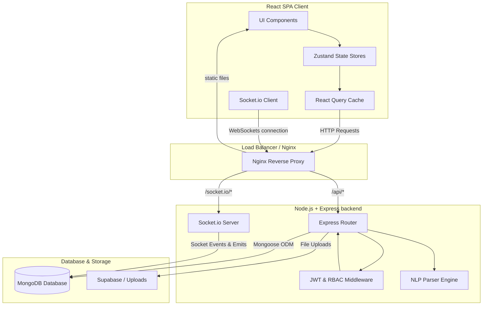
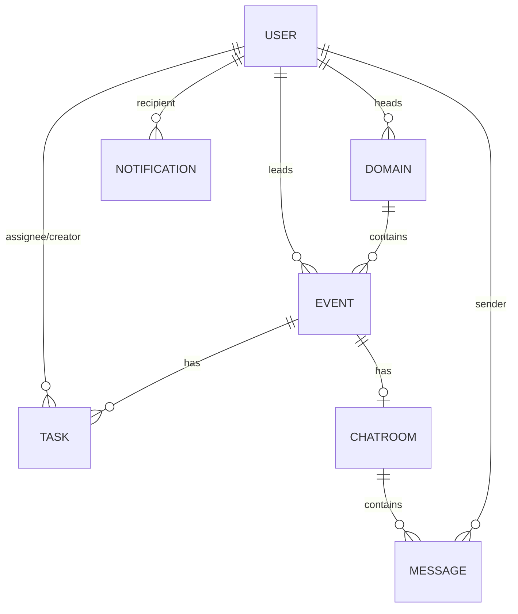

# EventOps Platform — Architecture & System Design Guide

This document provides a detailed overview of the system architecture, database models, security rules, and real-time messaging pipeline of the **EventOps Platform**.

---

## 🏛️ Architectural Overview

EventOps is built using a decoupled **MERN (MongoDB, Express, React, Node.js)** stack architecture, enhanced with **Socket.io** for real-time bi-directional messaging and status synchronization.

---

## 🔐 Authentication & Role-Based Access Control (RBAC)

The platform enforces strict role-based route protection at the backend and dynamic navigation layout changes on the client side.

### 🛡️ Permissions Matrix
The platform supports five roles, each mapped to specific permissions:

| Permission | Description | Admin | Domain Head | Event Head | Student Rep | Volunteer |
|---|---|:---:|:---:|:---:|:---:|:---:|
| `MANAGE_USERS` | Create/update users, edit global roles | ✅ | ❌ | ❌ | ❌ | ❌ |
| `CREATE_DOMAIN` | Create and configure event domains | ✅ | ❌ | ❌ | ❌ | ❌ |
| `MANAGE_DOMAIN` | Edit domain details, add members | ✅ | ✅ | ❌ | ❌ | ❌ |
| `CREATE_EVENT` | Create new events | ✅ | ✅ | ❌ | ❌ | ❌ |
| `MANAGE_EVENT` | Edit event details, assign Event Heads | ✅ | ✅ | ✅ | ❌ | ❌ |
| `ASSIGN_TASK` | Create tasks, assign members, set deadlines | ✅ | ✅ | ✅ | ✅ | ❌ |
| `UPDATE_TASK` | Toggle task statuses (To-Do, In Progress, Review, Done) | ✅ | ✅ | ✅ | ✅ | ✅ |
| `UPLOAD_FILES` | Upload and attach documents to events/tasks | ✅ | ✅ | ✅ | ✅ | ✅ |
| `SEND_BROADCAST` | Send global system-wide notifications | ✅ | ❌ | ❌ | ❌ | ❌ |

---

## 🗄️ Database Schemas & Data Model Relationships

Mongoose schemas enforce structure over MongoDB collections, creating rich relationships between users, domains, events, tasks, messages, and files.

### 1. User Model (`models/User.js`)
Stores user profiles, credentials (hashed via `bcryptjs`), and platform roles:
*   `collegeId` (String, unique, indexed) - e.g., `STU2025-001` or `FAC2024-001`.
*   `role` (String, enum) - `admin`, `domain_head`, `event_head`, `student_rep`, `volunteer`.

### 2. Domain Model (`models/Domain.js`)
Groups related events (e.g., Technical, Cultural, Sports):
*   `head` (ObjectId -> User) - The Domain Head responsible for operations.
*   `members` (Array of ObjectIds -> User) - Allowed members within this domain.

### 3. Event Model (`models/Event.js`)
Represents planning structures for specific events (e.g., Hackathon, Music Fest):
*   `domain` (ObjectId -> Domain) - Parent domain.
*   `eventHead` (ObjectId -> User) - Event manager/head.
*   `status` (String, enum) - `draft`, `planning`, `active`, `completed`, `cancelled`.

### 4. Task Model (`models/Task.js`)
Workflow tracking cards linked to specific events:
*   `event` (ObjectId -> Event) - Associated event.
*   `assignedTo` (Array of ObjectIds -> User) - Task assignees.
*   `status` (String, enum) - `todo`, `in_progress`, `review`, `done`.
*   `priority` (String, enum) - `low`, `medium`, `high`, `urgent`.

### 5. Chat & Message Model (`models/Message.js`)
Stores messaging configurations and message history:
*   **ChatRoom**: Stores metadata, room types (`domain`, `event`, `direct`, `broadcast`), and member lists.
*   **Message**: References `sender`, `room`, the textual body, and optional `attachments`.

---

## ⚡ Real-Time WebSockets Pipeline (`sockets/`)

The WebSocket system enables real-time collaboration using a customized Socket.io architecture.

### Connection & Authentication Flow
1. **Handshake**: The Socket.io client passes the user's JWT token in the `auth` headers during connection.
2. **Authentication Middleware**: The server validates the token, extracts the user details, and attaches them to the socket object.
3. **Room Joins**: The client joins default rooms:
   - User-specific private room (for receiving direct notifications).
   - Chat rooms corresponding to the events and domains the user is a member of.

### Real-Time Events Map

| Event Name | Sent By | Description | Payload |
|---|---|---|---|
| `join:room` | Client | Join an event or domain chat room | `roomId` |
| `leave:room` | Client | Leave a chat room | `roomId` |
| `chat:message` | Client/Server | Send or broadcast a new message | `{ room, text, sender }` |
| `chat:typing` | Client/Server | Broadcast a typing indicator to other room members | `{ room, isTyping, user }` |
| `task:updated` | Server | Broadcast task additions/status updates to event members | `{ eventId, task }` |
| `notification` | Server | Send direct notifications (e.g., task assigned, overdue alert) | `{ title, body, link, priority }` |

---

## 🧠 Smart Chat-to-Task Natural Language Processing (NLP)

One of the platform's core automation features is the rule-based NLP engine inside the chat room interface (`react-app/src/utils/nlp.js`). 

When a coordinator enters a message, the engine parses it using regular expressions and keyword extractors.

### 1. Extraction Rules
- **Task Identification**: Triggers on verbs like `create`, `add`, `assign`, `make`, `setup`, `book`, `send`.
- **Date/Deadline Extraction**: Parses relative date patterns:
  - `today` / `tonight` -> Generates date object for current day at 5:00 PM.
  - `tomorrow` / `by tomorrow` -> Generates date object for the next day.
  - `next monday/friday/etc` -> Calculates index of the next occurring day.
  - `by 15th` / `on 20 May` -> Parses calendar date strings.
- **Assignee Parsing**: Matches phrases like `to @username` or `for @username` against active team usernames.

### 2. Quick Action Modal Trigger
If an action is detected (e.g., *"@Karan book the seminar hall tomorrow by 3 PM"*):
1. A small badge pops up above the text area saying **"Suggested Task: Book the seminar hall (Assign to: Karan)"**.
2. Clicking it opens the **New Task Modal**, pre-filling the task title, assignee, and deadline date.
3. Once reviewed and submitted, the task is saved to MongoDB and synced to all other active team members' dashboards instantly.
